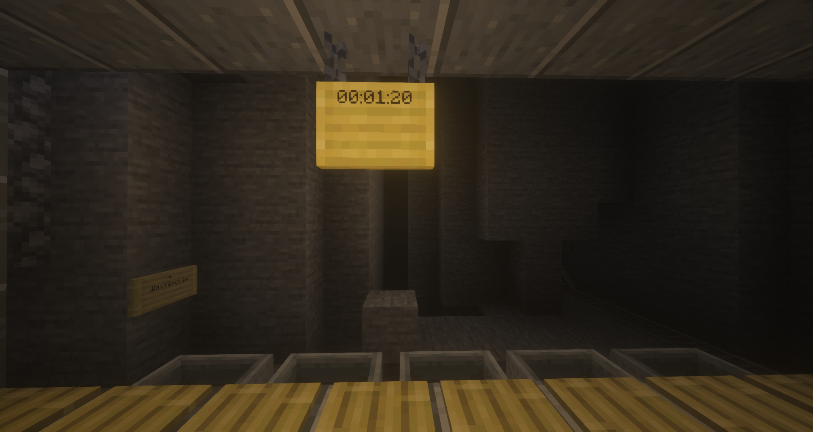

# Train Carts Stop Watch Plugin
This plugin adds a new sign for the [TrainCarts](https://github.com/bergerhealer/TrainCarts) plugin ([SignLink](https://github.com/bergerhealer/SignLink) is required)

It counts how much time has passed since the arrival of the last train

Make a trigger sign
```
[train]
stopwatch
my_stopwatch
```

Then, put another sign and use the placeholder %my_stopwatch% to show stopwatch time

---

Этот плагин добавляет новую табличку для плагина TrainCarts (и Link Signs)

Она считает, сколько времени прошло с момента прибытия последнего поезда

Сделайте табличку-триггер
```
[train]
stopwatch
my_stopwatch
```

Затем, поставьте другую табличку и используйте плейсхолдер %my_stopwatch%

